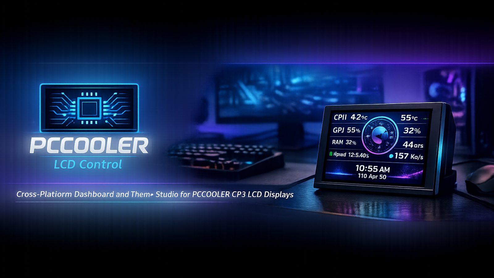

<p align="center">
  
</p>

# PCCOOLER-LCD Control 3.0.0 Beta 11

Beta 11 begins experimental native-media support based on the recovered CP3
1.5.27 application protocol.

## Prepare compatible media

```fish
pccooler-lcd-control media-prepare input.mp4 \
  --output input-cp3.mp4 \
  --width 320 \
  --height 240 \
  --fps 30
```

The preparation pipeline uses the recovered Windows settings:

- H.264 MP4
- `yuv420p`
- no B-frames
- fast-start metadata
- even crop and scale dimensions
- no audio

GIF input is accepted by FFmpeg and converted to MP4.

## Inspect media

```fish
pccooler-lcd-control media-info input-cp3.mp4
```

## Experimental upload

First perform a dry run:

```fish
pccooler-lcd-control media-upload input.mp4
```

To send the block-transfer transaction:

```fish
systemctl --user stop pccooler-lcd-control.service

pccooler-lcd-control media-upload input.mp4 \
  --remote-name test.mp4 \
  --execute \
  --verbose
```

This uses the confirmed `POST transport` and `POST transported` file-transfer
envelope. The exact command that lists or selects stored media is still being
recovered, so upload success does not yet mean the file will appear on screen.

## Protocol tracing

Preview a request without sending it:

```fish
pccooler-lcd-control protocol-request "GET media" \
  --json '{"example":true}' \
  --trace /tmp/cp3-request.json
```

Sending an unconfirmed command requires `--execute`.

## Protocol research

See:

```text
docs/protocol/cp3_protocol_findings.md
docs/protocol/cp3_reverse_engineering_bundle.zip
```
